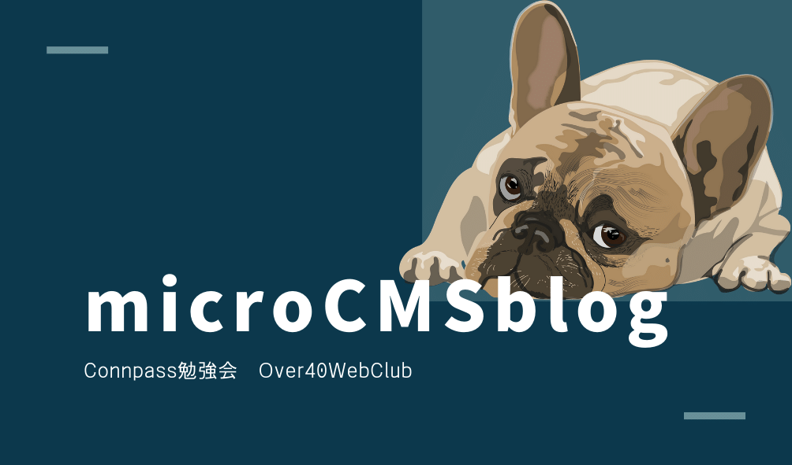

<!-- AUTO-GENERATED-CONTENT:START (STARTER) -->
<p align="center">
  <a href="https://over40webclub.connpass.com/event/212129/">
    
  </a>
</p>
<h1 align="center">
  Gatsby-microCMS Blog starter
</h1>

このスターターは、Gatsby-microCMSを連携したブログを構築できます。
デザインは、startBootstrapからCleanBlogというテンプレートを使っています。

## 🚀 Quick start

1.  **新しいGatsbyサイトを作る**

    GatsbyCLIで新しいプロジェクトを開始します。シェルで以下のコマンドを実行します。

    ```shell
    # create a new Gatsby site using the Gatsby-microCMS Blog starter

    gatsby new my-blog https://github.com/sonho463/starter-microcms-gc.git

    ```

2.  **GatsbyとmicroCMSを接続する設定**

    1. コードエディタでプロジェクトを開きます。
    2. ルートフォルダに`.env.development` `.env.production`ファイルを作成
    3. それぞれのファイルに、以下の内容を記述

			```
			MICROCMS_API_KEY = "Your API-KEY"
			MICROCMS_SERVICE_ID = "Your ServiceID"
			```
3. **microCMSのデータベースを準備**
   1. ３つのAPIを作成。
		|API    |形式    |エンドポイント|
		|-------|-------|------------|
		|記事API|リスト形式|posts      |
		|カテゴリAPI|リスト形式|category |
		|設定API|オブジェクト形式|config |
	2. 記事APIとカテゴリAPIのschemaをインポート
       - /microcmsSampleFiles/microcmsSchemaフォルダ内
	3. コンテンツもCSVからインポート
         - 直接データを入力してもOK
	4. microCMSのデータは次のことに注意
      	1. 記事データは２つ、カテゴリデータは１つ以上のデータをいれておく
      	2. １つ以上の記事データのアイキャッチ画像とauthorフィールドは空にしない

4.  **Open the source code and start editing!**

    Your site is now running at `http://localhost:8000`!

    _Note: You'll also see a second link: _`http://localhost:8000/___graphql`_. This is a tool you can use to experiment with querying your data. Learn more about using this tool in the [Gatsby tutorial](https://www.gatsbyjs.com/tutorial/part-five/#introducing-graphiql)._

    Open the `my-hello-world-starter` directory in your code editor of choice and edit `src/pages/index.js`. Save your changes and the browser will update in real time!

## 🚀 Quick start (Gatsby Cloud)

Deploy this starter with one click on [Gatsby Cloud](https://www.gatsbyjs.com/cloud/):

[](https://www.gatsbyjs.com/dashboard/deploynow?url=https://github.com/gatsbyjs/gatsby-starter-hello-world)

## 🧐 What's inside?

A quick look at the top-level files and directories you'll see in a Gatsby project.

    .
    ├── node_modules
    ├── src
    ├── .gitignore
    ├── .prettierrc
    ├── gatsby-browser.js
    ├── gatsby-config.js
    ├── gatsby-node.js
    ├── gatsby-ssr.js
    ├── LICENSE
    ├── package-lock.json
    ├── package.json
    └── README.md

1.  **`/node_modules`**: This directory contains all of the modules of code that your project depends on (npm packages) are automatically installed.

2.  **`/src`**: This directory will contain all of the code related to what you will see on the front-end of your site (what you see in the browser) such as your site header or a page template. `src` is a convention for “source code”.

3.  **`.gitignore`**: This file tells git which files it should not track / not maintain a version history for.

4.  **`.prettierrc`**: This is a configuration file for [Prettier](https://prettier.io/). Prettier is a tool to help keep the formatting of your code consistent.

5.  **`gatsby-browser.js`**: This file is where Gatsby expects to find any usage of the [Gatsby browser APIs](https://www.gatsbyjs.com/docs/browser-apis/) (if any). These allow customization/extension of default Gatsby settings affecting the browser.

6.  **`gatsby-config.js`**: This is the main configuration file for a Gatsby site. This is where you can specify information about your site (metadata) like the site title and description, which Gatsby plugins you’d like to include, etc. (Check out the [config docs](https://www.gatsbyjs.com/docs/gatsby-config/) for more detail).

7.  **`gatsby-node.js`**: This file is where Gatsby expects to find any usage of the [Gatsby Node APIs](https://www.gatsbyjs.com/docs/node-apis/) (if any). These allow customization/extension of default Gatsby settings affecting pieces of the site build process.

8.  **`gatsby-ssr.js`**: This file is where Gatsby expects to find any usage of the [Gatsby server-side rendering APIs](https://www.gatsbyjs.com/docs/ssr-apis/) (if any). These allow customization of default Gatsby settings affecting server-side rendering.

9.  **`LICENSE`**: This Gatsby starter is licensed under the 0BSD license. This means that you can see this file as a placeholder and replace it with your own license.

10. **`package-lock.json`** (See `package.json` below, first). This is an automatically generated file based on the exact versions of your npm dependencies that were installed for your project. **(You won’t change this file directly).**

11. **`package.json`**: A manifest file for Node.js projects, which includes things like metadata (the project’s name, author, etc). This manifest is how npm knows which packages to install for your project.

12. **`README.md`**: A text file containing useful reference information about your project.

## 🎓 Learning Gatsby

Looking for more guidance? Full documentation for Gatsby lives [on the website](https://www.gatsbyjs.com/). Here are some places to start:

- **For most developers, we recommend starting with our [in-depth tutorial for creating a site with Gatsby](https://www.gatsbyjs.com/tutorial/).** It starts with zero assumptions about your level of ability and walks through every step of the process.

- **To dive straight into code samples, head [to our documentation](https://www.gatsbyjs.com/docs/).** In particular, check out the _Guides_, _API Reference_, and _Advanced Tutorials_ sections in the sidebar.

## 💫 Deploy

[Build, Deploy, and Host On The Only Cloud Built For Gatsby](https://www.gatsbyjs.com/cloud/)

Gatsby Cloud is an end-to-end cloud platform specifically built for the Gatsby framework that combines a modern developer experience with an optimized, global edge network.

<!-- AUTO-GENERATED-CONTENT:END -->
